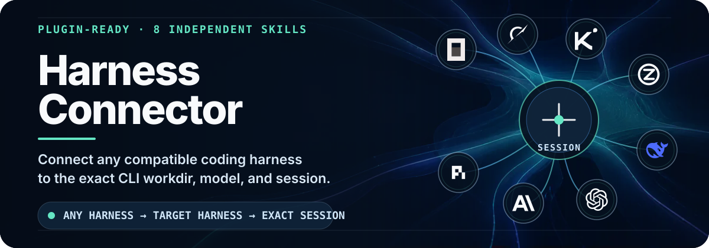

<p align="center">
  <picture>
    <source media="(max-width: 640px)" srcset="assets/readme/hero-mobile.svg">
    
  </picture>
</p>

<p align="center">
  <a href="https://github.com/ZiChenWang114514/Harness-Connector/actions/workflows/ci.yml"></a>
  <a href="skills/"></a>
  <a href="LICENSE"></a>
  <br>
  <a href="README.zh-CN.md">简体中文</a>
</p>

Harness Connector collects eight proven coding-harness session skills without merging their runtimes. Each skill keeps its own CLI adapter, session rules, model checks, documentation, tests, and original invocation name. You may copy one skill by itself or treat the repository as a complete Codex plugin package.

## Skill catalog

<!-- skill-matrix:start -->
| Skill | Target Harness | Commands | Source | Verification |
|---|---|---|---|---|
| [`$codex-opencode-session`](skills/codex-opencode-session/) | OpenCode | `status`, `free-pool`, `invoke`, `smoke-test` | [Any-to-OpenCode](https://github.com/ZiChenWang114514/Any-to-OpenCode) @ `0c256494` | `local-real-smoke` |
| [`$codex-grok-build`](skills/codex-grok-build/) | Grok Build | `status`, `list`, `inspect`, `wait`, `invoke`, `smoke-test` | [Any-to-Grok-Build](https://github.com/ZiChenWang114514/Any-to-Grok-Build) @ `70026ddc` | `local-real-smoke` |
| [`$codex-kimi-session`](skills/codex-kimi-session/) | Kimi Code | `status`, `inspect`, `invoke`, `smoke-test` | [Any-to-Kimi-Code](https://github.com/ZiChenWang114514/Any-to-Kimi-Code) @ `f7f1dddf` | `source-recorded` |
| [`$codex-zcode-session`](skills/codex-zcode-session/) | ZCode | `status`, `invoke`, `smoke-test` | [Any-to-ZCode](https://github.com/ZiChenWang114514/Any-to-ZCode) @ `497f678d` | `local-real-smoke` |
| [`$codex-dsh-session`](skills/codex-dsh-session/) | DeepSeek Harness | `status`, `invoke`, `smoke-test` | [Any-to-DeepSeek-Harness](https://github.com/ZiChenWang114514/Any-to-DeepSeek-Harness) @ `a6d99e6c` | `source-recorded` |
| [`$codex-cli-session`](skills/codex-cli-session/) | Codex CLI | `status`, `invoke`, `resume`, `fork`, `smoke-test` | [Any-to-Codex](https://github.com/ZiChenWang114514/Any-to-Codex) @ `1a4a2923` | `local-real-smoke` |
| [`$codex-claude-session`](skills/codex-claude-session/) | Claude Code | `status`, `invoke`, `resume`, `smoke-test` | [Any-to-Claude-Code](https://github.com/ZiChenWang114514/Any-to-Claude-Code) @ `f8a47686` | `source-recorded` |
| [`$codex-pi-session`](skills/codex-pi-session/) | Pi | `status`, `invoke`, `resume`, `fork`, `smoke-test` | [Any-to-Pi](https://github.com/ZiChenWang114514/Any-to-Pi) @ `7306fe19` | `source-recorded` |
<!-- skill-matrix:end -->

Verification labels describe evidence imported from each source project. This initial aggregation does not make fresh billable model calls.

## Why this repository exists

- **Independent by design:** a change for ZCode cannot silently alter Pi, Claude Code, or another adapter.
- **Compatible paths and commands:** the eight existing Skill IDs and command-line interfaces remain intact.
- **Auditable imports:** every snapshot records its public source repository and exact `main` commit.
- **Repeatable maintenance:** local tooling checks structure, regenerates the catalog, and reports upstream changes.
- **Credential-free publication:** CI uses unit tests and simulated subprocesses; live model credentials stay outside the repository.

## Repository layout

```text
Harness-Connector/
├─ .codex-plugin/plugin.json
├─ skills/<skill-id>/
├─ catalog/skills.json
├─ tools/
├─ tests/
├─ docs/
└─ .github/workflows/ci.yml
```

Every directory under `skills/` is a complete, independently usable project snapshot. Runtime code is intentionally not centralized.

## Use one skill

Copy the selected directory into your Codex skills folder and keep the directory name unchanged. For example, in PowerShell:

```powershell
Copy-Item -Recurse `
  .\skills\codex-pi-session `
  "$env:USERPROFILE\.codex\skills\codex-pi-session"
```

Restart Codex after installing a skill. The invocation remains `$codex-pi-session`; the same rule applies to the other seven IDs.

## Use as a plugin package

The root manifest declares only `./skills/`. It does not register MCP servers, hooks, applications, or external services. Plugin installation is deliberately left to the host's supported repository-install flow; cloning this repository alone does not change local Codex configuration.

## Validate the collection

```powershell
python tools/audit_skills.py
python tools/generate_catalog.py --check
python -m unittest discover -s tests -v
```

Each adapter also retains its original test suite under `skills/<skill-id>/tests/`.

## Synchronize an upstream project

Check all recorded source commits:

```powershell
python tools/sync_from_sources.py --check
```

Update one collection snapshot from its public source repository:

```powershell
python tools/sync_from_sources.py --apply --skill codex-pi-session
```

The update command writes only inside this repository. Review and test the resulting change before committing it. Local Codex skills and the eight source repositories are never modified.

## Documentation

- [Import report](docs/import-report.md)
- [Generated skill catalog](docs/skill-catalog.md)
- [Contributing guide](CONTRIBUTING.md)
- [Change log](CHANGELOG.md)

## License

Harness Connector is released under the [MIT License](LICENSE). Individual imported project notices remain with their respective skill snapshots.
