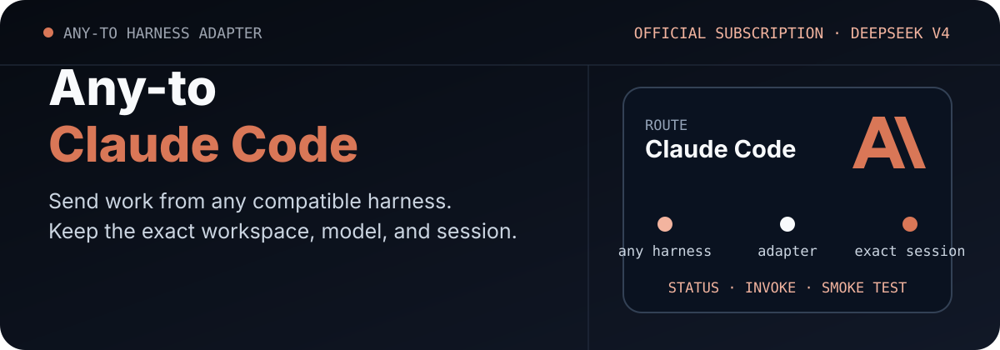

<p align="center">
  <picture>
    <source media="(max-width: 680px)" srcset="./assets/readme/hero-mobile.svg">
    
  </picture>
</p>

<p align="center"><strong>English</strong> · <a href="./README.zh-CN.md">简体中文</a></p>

<p align="center">
  <a href="https://github.com/ZiChenWang114514/Any-to-Claude-Code/actions/workflows/ci.yml"></a>
  · Windows · Python 3.11+ · MIT
</p>

# Any-to-Claude-Code

Connect any compatible coding harness to local Claude Code sessions. The adapter supports an official Claude subscription by default and an explicit DeepSeek Anthropic-compatible route for V4 Pro and V4 Flash.

Provider selection applies to one child process. The repository never stores an API key or rewrites the user's long-term Claude settings.

## Proof first

```powershell
python .\scripts\claude_session.py status --provider official --json
python .\scripts\claude_session.py status --provider deepseek --model pro --json
```

The official status checks Claude authentication. The DeepSeek status reports only whether `DEEPSEEK_API_KEY` is present and whether the local CLI supports print mode, JSON output, exact resume, model selection, and permission modes.

## Provider routes

| Provider | Authentication | Models | Intended use |
|---|---|---|---|
| `official` | Claude Pro, Max, Team, Enterprise, or Console login | Account default or `--model` | Public default |
| `deepseek` | `DEEPSEEK_API_KEY` inherited by the child process | `deepseek-v4-pro[1m]`, `deepseek-v4-flash` | Explicit compatibility route |

DeepSeek uses `https://api.deepseek.com/anthropic`, following the official DeepSeek integration for Claude Code.

## How it works

```text
Any compatible harness
        │
        ▼
scripts/claude_session.py
        │
        ├── official subscription
        └── DeepSeek Anthropic API
                 │
                 ▼
Exact Claude Code session
```

## Install

```powershell
git clone https://github.com/ZiChenWang114514/Any-to-Claude-Code.git `
  "$env:USERPROFILE\.codex\skills\codex-claude-session"
```

Other harnesses can clone the repository anywhere and call the Python script directly.

## First successful run

Official subscription:

```powershell
python .\scripts\claude_session.py invoke `
  --workdir C:\path\to\repo `
  --prompt "Inspect this repository and summarize its tests." `
  --permission-mode plan `
  --json
```

DeepSeek V4 Pro:

```powershell
python .\scripts\claude_session.py invoke `
  --provider deepseek --model pro `
  --workdir C:\path\to\repo `
  --prompt "Inspect this repository and summarize its tests." `
  --permission-mode plan `
  --json
```

Use `--model flash` for the fast DeepSeek route.

## Resume an exact session

```powershell
python .\scripts\claude_session.py resume `
  --provider deepseek --model flash `
  --session-id <session-id> `
  --prompt "Continue from the verified result." `
  --json
```

The provider and model are explicit for resumed automation. The adapter does not choose the most recent session.

## Machine-readable contract

Every command accepts `--json`. Shared fields are:

```text
schema_version · ok · target · command · provider · workdir
session_id · requested_model · actual_model · result · warnings · error
```

Adapter-specific fields remain available beside the shared contract.

## Verification

```powershell
python -m unittest discover -s tests -v
python .\scripts\claude_session.py smoke-test --provider deepseek --model pro --json
python .\scripts\claude_session.py smoke-test --provider deepseek --model flash --json
```

Unit tests verify provider isolation and response parsing without credentials. Real tests use a temporary Git workspace and a fixed reply marker.

## Credential handling

- The public default is the official Claude subscription.
- DeepSeek is enabled only when `--provider deepseek` is supplied.
- `DEEPSEEK_API_KEY` is mapped to `ANTHROPIC_AUTH_TOKEN` inside the child environment.
- The key is never printed, copied to Claude settings, or committed.
- Official mode removes third-party provider variables only from its child process.

## Related adapters

| Repository | Target |
|---|---|
| [Any-to-OpenCode](https://github.com/ZiChenWang114514/Any-to-OpenCode) | OpenCode |
| [Any-to-Grok-Build](https://github.com/ZiChenWang114514/Any-to-Grok-Build) | Grok Build |
| [Any-to-Kimi-Code](https://github.com/ZiChenWang114514/Any-to-Kimi-Code) | Kimi Code |
| [Any-to-ZCode](https://github.com/ZiChenWang114514/Any-to-ZCode) | ZCode / GLM |
| [Any-to-DeepSeek-Harness](https://github.com/ZiChenWang114514/Any-to-DeepSeek-Harness) | DeepSeek Harness |
| [Any-to-Codex](https://github.com/ZiChenWang114514/Any-to-Codex) | Codex CLI |

## License

MIT. This independent adapter is not an official Anthropic or DeepSeek product.
