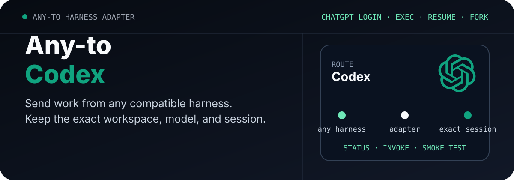

<p align="center">
  <picture>
    <source media="(max-width: 680px)" srcset="./assets/readme/hero-mobile.svg">
    
  </picture>
</p>

<p align="center"><strong>English</strong> · <a href="./README.zh-CN.md">简体中文</a></p>

<p align="center">
  <a href="https://github.com/ZiChenWang114514/Any-to-Codex/actions/workflows/ci.yml"></a>
  · Windows · Python 3.11+ · MIT
</p>

# Any-to-Codex

Connect any compatible coding harness to the local Codex CLI. The adapter starts a non-interactive task in an explicit workspace, returns one stable JSON result, and continues or forks an exact thread ID.

It uses the user's existing ChatGPT login and Codex configuration. It does not install Codex, copy credentials, choose a global model, or bypass Codex permissions.

## Proof first

```powershell
python .\scripts\codex_session.py status --json
```

The status command checks the installed CLI, ChatGPT authentication, configured default model, and the flags required for JSONL execution, structured output, model selection, and ephemeral tests.

## How it works

```text
Any compatible harness
        │
        ▼
scripts/codex_session.py
        │  codex exec --json
        ▼
Exact Codex thread in the requested workspace
```

The Python adapter is the portable interface. `$codex-cli-session` is an optional Codex Skill wrapper around the same commands.

## Install

```powershell
git clone https://github.com/ZiChenWang114514/Any-to-Codex.git `
  "$env:USERPROFILE\.codex\skills\codex-cli-session"
```

Other harnesses can clone the repository anywhere and call `scripts/codex_session.py` directly.

## First successful run

```powershell
python .\scripts\codex_session.py invoke `
  --workdir C:\path\to\repo `
  --prompt "Inspect this repository and summarize the test commands." `
  --sandbox read-only `
  --json
```

The model comes from the user's Codex configuration unless `--model` is supplied for that call.

## Exact session lifecycle

```powershell
python .\scripts\codex_session.py resume `
  --session-id <thread-id> `
  --prompt "Continue from the previous result." `
  --json

python .\scripts\codex_session.py fork `
  --session-id <thread-id> `
  --prompt "Explore an independent implementation." `
  --json
```

`resume` preserves the original conversation. `fork` creates a new thread from the selected history. Both require an exact ID.

## Machine-readable contract

Every command accepts `--json`. Shared fields are:

```text
schema_version · ok · target · command · provider · workdir
session_id · requested_model · actual_model · result · warnings · error
```

Success uses exit code `0`; execution or verification failure uses `1`; invalid CLI arguments use `2`.

## Verification

```powershell
python -m unittest discover -s tests -v
python .\scripts\codex_session.py smoke-test --json
```

Unit tests do not require credentials. The real smoke test creates a temporary Git workspace and verifies a new thread, an exact resume, and a fork using the current ChatGPT-authenticated Codex model.

## Operational notes

- Use `--sandbox read-only` for analysis and `workspace-write` for authorized implementation.
- Use `--ephemeral` only when session persistence is intentionally unnecessary.
- The adapter never selects the latest session automatically.
- Review actual file changes and project tests after an agentic task.
- Authentication data and the complete Codex configuration are never emitted.

## Related adapters

| Repository | Target |
|---|---|
| [Any-to-OpenCode](https://github.com/ZiChenWang114514/Any-to-OpenCode) | OpenCode |
| [Any-to-Grok-Build](https://github.com/ZiChenWang114514/Any-to-Grok-Build) | Grok Build |
| [Any-to-Kimi-Code](https://github.com/ZiChenWang114514/Any-to-Kimi-Code) | Kimi Code |
| [Any-to-ZCode](https://github.com/ZiChenWang114514/Any-to-ZCode) | ZCode / GLM |
| [Any-to-DeepSeek-Harness](https://github.com/ZiChenWang114514/Any-to-DeepSeek-Harness) | DeepSeek Harness |
| [Any-to-Claude-Code](https://github.com/ZiChenWang114514/Any-to-Claude-Code) | Claude Code |
| [Any-to-Claude-Code](https://github.com/ZiChenWang114514/Any-to-Claude-Code) | Claude Code |
| [Any-to-Claude-Code](https://github.com/ZiChenWang114514/Any-to-Claude-Code) | Claude Code |

## License

MIT. This independent adapter is not an official OpenAI product.
