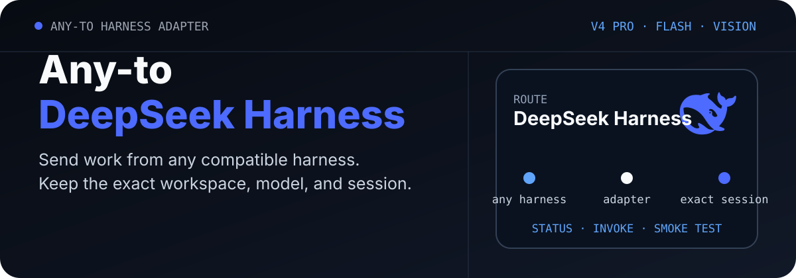

<p align="center">
  <picture>
    <source media="(max-width: 680px)" srcset="./assets/readme/hero-mobile.svg">
    
  </picture>
</p>

<p align="center">
  <a href="./README.md">English</a> · <strong>简体中文</strong>
</p>

<p align="center">
  <a href="https://github.com/ZiChenWang114514/Any-to-DeepSeek-Harness/actions/workflows/ci.yml"></a>
  · Windows · Python 3.10+ · MIT
</p>

# Any-to-DeepSeek-Harness

把任意兼容的编码助手接到本机 DeepSeek Harness 会话。它会在不暴露 API Key 的前提下检查当前 V4 线路，在指定仓库运行一次无头任务，并识别这次调用新建的会话条目。

本仓库是本地会话适配器：一套 Python 命令行工具，外加 Codex Skill 封装。它独立于 DeepSeek。DeepSeek Harness 仍在快速预发布，升级后请重新运行状态检查、单元测试和冒烟测试。

## 已核验内容

| 模型或组件 | 当前证据 |
| --- | --- |
| Skill 结构与 Python 封装 | 在 Windows CI 中通过 |
| DeepSeek Harness | 本机检测到 `0.1.1-rc.2` |
| `deepseek-v4-flash` | 隔离真实请求返回 `DSH_SMOKE_OK` |
| `deepseek-v4-pro` | 已检测到内置线路；仍需单独的真实请求 |
| `deepseek-v4-flash-vision-exp` | 已检测到图文能力声明；仍需一次带图片的往返 |

适配器列出的模型只说明可以选择。只有真实请求成功，才能确认当前可访问。

## 它能做什么

- 报告当前 provider、模型和推理强度，但不打印 `DEEPSEEK_API_KEY`。
- 每次调用都从用户给出的目录开始。
- 比较无头任务前后的会话目录。
- 超时时只停止本封装启动的进程树。
- 在临时 `DSH_HOME` 中做隔离冒烟测试。

当前 CLI 没有提供无头模式的精确继续参数。需要继续已有会话时，应在 TUI 或 Web profile 中使用完整会话 ID 和原工作区。

Codex、Claude Code、Grok Build 等工具都可以直接调用 Python 脚本。安装 Skill 后，Codex 也可以使用 `$codex-dsh-session`。

## 安装

```powershell
npm install -g @deepseek-ai/dsh
dsh --version
```

通过你平时的密钥管理方式配置 `DEEPSEEK_API_KEY`。不要把密钥放进仓库、提示文件或命令参数。

```powershell
git clone https://github.com/ZiChenWang114514/Any-to-DeepSeek-Harness.git `
  "$env:USERPROFILE\.codex\skills\codex-dsh-session"
```

克隆目标目录是 Codex Skill 标识 `codex-dsh-session`。其他编码助手可以直接运行 `scripts/dsh_session.py`。

## 最快开始

```powershell
python "$env:USERPROFILE\.codex\skills\codex-dsh-session\scripts\dsh_session.py" `
  status --json
```

常见字段：

```json
{
  "provider": "deepseek-official",
  "default_model": "deepseek-v4-flash",
  "reasoning_effort": "max",
  "required_models_present": true,
  "model_access_configured": true
}
```

运行一次无头任务：

```powershell
python .\scripts\dsh_session.py invoke `
  --dir C:\path\to\repo `
  --prompt "检查这个仓库，并说明失败测试的原因。" `
  --json
```

更长的说明使用提示文件：

```powershell
python .\scripts\dsh_session.py invoke `
  --dir C:\path\to\repo `
  --prompt-file .\task.txt `
  --json
```

headless profile 每次都会创建新的持久 Agent。

## 模型线路

| 模型 | 适用场景 | 此处核验情况 |
| --- | --- | --- |
| `deepseek-v4-pro` | 更高能力的编码与分析 | 线路可见 |
| `deepseek-v4-flash` | 较快的通用编码 | 真实文本回复 |
| `deepseek-v4-flash-vision-exp` | 文本加图片输入 | 能力元数据 |

默认模型来自 `$DSH_HOME/settings.yaml` 的 `agent-default-model`。修改后只影响之后创建的 Agent；已有会话保留当时记录的模型。

## 核验步骤

1. 运行 `status --json`，确认版本、provider、模型 ID 和凭据是否存在。
2. 阅读目标仓库说明、当前改动和测试命令。
3. 用明确的目录和提示启动一次无头任务。
4. 检查返回内容和新出现的会话条目。
5. 检查实际文件变化，并运行项目自己的测试。

安装或升级后：

```powershell
python .\scripts\dsh_session.py smoke-test `
  --dir C:\path\to\safe-dir --json
```

纯文本请求不能确认图片能力。验证视觉线路时，请用 TUI 或 Web 新会话附上一张无敏感信息的测试图片。

## 在编码助手中使用

```text
使用 $codex-dsh-session，在 C:\path\to\repo 检查状态，
然后运行一次无头任务，说明失败测试的原因，不要改文件。
```

## 安全说明

- 状态输出不会读出 API Key 的值。
- 封装不会终止无关的 DSH 或 Node 进程。
- 它不会自行提交、推送、发布或改动无关文件。
- 有回复和退出码之后，仍需检查仓库文件和测试。

## 机器可读结果

每个命令都支持 `--json`。统一字段包括 `schema_version`、`ok`、`target`、`command`、`provider`、`workdir`、`session_id`、`requested_model`、`actual_model`、`result`、`warnings` 和 `error`，并保留各适配器自己的验证信息。

## 同系列适配器

| 仓库 | 目标 |
| --- | --- |
| [Any-to-OpenCode](https://github.com/ZiChenWang114514/Any-to-OpenCode) | OpenCode |
| [Any-to-Grok-Build](https://github.com/ZiChenWang114514/Any-to-Grok-Build) | Grok Build |
| [Any-to-Kimi-Code](https://github.com/ZiChenWang114514/Any-to-Kimi-Code) | Kimi Code |
| [Any-to-ZCode](https://github.com/ZiChenWang114514/Any-to-ZCode) | ZCode / GLM |
| [Any-to-Codex](https://github.com/ZiChenWang114514/Any-to-Codex) | Codex CLI |
| [Any-to-Claude-Code](https://github.com/ZiChenWang114514/Any-to-Claude-Code) | Claude Code |
| [Any-to-Pi](https://github.com/ZiChenWang114514/Any-to-Pi) | Pi |
| [Any-to-Antigravity](https://github.com/ZiChenWang114514/Any-to-Antigravity) | Google Antigravity CLI |

## 许可证

[MIT](./LICENSE)
