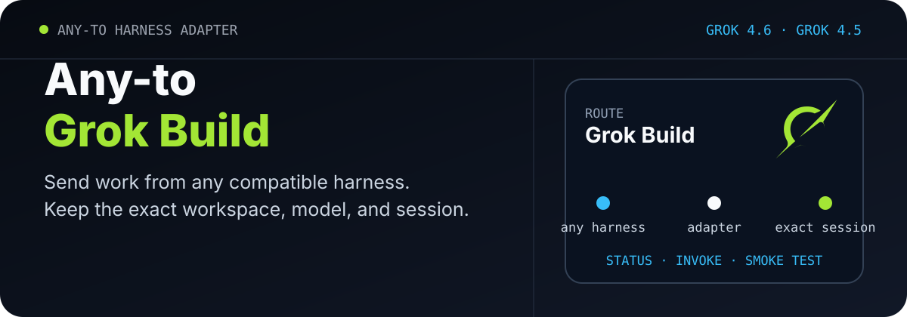
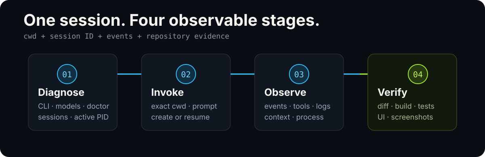

<p align="center">
  <picture>
    <source media="(max-width: 680px)" srcset="./assets/readme/hero-mobile.svg">
    
  </picture>
</p>

<p align="center">
  <a href="./README.md">English</a> · <strong>简体中文</strong>
</p>

<p align="center">
  <a href="./docs/zh-CN/getting-started.md">快速开始</a> ·
  <a href="./docs/zh-CN/commands.md">命令手册</a> ·
  <a href="./docs/zh-CN/session-lifecycle.md">会话生命周期</a> ·
  <a href="./docs/zh-CN/troubleshooting.md">故障诊断</a> ·
  <a href="./SKILL.md">Skill 说明</a>
</p>

# Any-to-Grok-Build

把任意兼容的编码助手接到本机 Grok Build 会话。它负责创建、继续、检查和核验无头 Grok CLI 工作，同时保留 Grok 自己的会话文件。

本仓库是本地会话适配器：一套 Python 命令行工具，外加 Codex Skill 封装。它不负责安装 Grok Build，也不是 xAI 官方产品。当前实现已经在 Grok 1.0.5 上完成真实调用；运行时仍以本机 `grok --help` 和 `grok models` 为准。

## 它能做什么

- 按准确工作目录查找会话，拒绝在错误目录继续某个 session ID。
- 创建或继续无头 Grok 会话，并保存 prompt、stdout、stderr 与 debug 日志。
- 从 `signals.json` 和最近事件读取上下文，需要时单独发送 `/compact`。
- 结合 `turn_completed`、待处理工具调用、文件稳定性、进程和端口判断一轮是否结束。
- 在 Grok 更新后运行真实冒烟测试，并只删除本次创建的测试会话。

Codex、Claude Code、OpenCode 等工具都可以直接调用 Python 脚本。安装 Skill 后，Codex 也可以使用 `$codex-grok-build`。

## 工作方式

<p align="center">
  
</p>

1. **Diagnose**：检查 CLI、模型、doctor、会话目录与活动 PID。
2. **Invoke**：在指定目录创建会话，或使用准确 ID 继续已有会话。
3. **Observe**：读取状态文件、事件、上下文和日志，再决定下一步。
4. **Verify**：检查实际代码差异，并运行项目自己的验证命令。

## 安装

需要 Python 3.10 或更高版本，以及已经安装并登录的 Grok Build CLI。

```powershell
git clone https://github.com/ZiChenWang114514/Any-to-Grok-Build.git `
  "$env:USERPROFILE\.codex\skills\codex-grok-build"
```

克隆目标目录是 Codex Skill 标识 `codex-grok-build`。如果该目录已经存在，请先检查本地修改再更新。其他编码助手可以直接运行 `scripts/grok_session.py`。

## 五分钟开始使用

### 1. 检查环境

```powershell
python "$env:USERPROFILE\.codex\skills\codex-grok-build\scripts\grok_session.py" `
  status --json
```

成功结果会报告 Grok 版本、默认模型、可用模型、关键参数、doctor 结果、会话目录和活动会话。

### 2. 运行兼容性测试

首次安装或 Grok 更新后，在安全目录中创建一次短会话：

```powershell
python "$env:USERPROFILE\.codex\skills\codex-grok-build\scripts\grok_session.py" `
  smoke-test --dir "C:\path\to\safe-dir" --json
```

测试会禁用工具、子 Agent、规划与网页搜索。精确回复和实际模型通过后，本次测试会话与默认临时日志会被删除。

### 3. 创建编码会话

将较长任务保存为 UTF-8 文本：

```powershell
python "$env:USERPROFILE\.codex\skills\codex-grok-build\scripts\grok_session.py" `
  invoke --dir "C:\path\to\repo" `
  --prompt-file "C:\path\to\phase.txt" --json
```

返回结果包含 `session_id`、实际模型、回复、停止原因与日志目录。继续同一会话时使用原来的工作目录：

```powershell
python "$env:USERPROFILE\.codex\skills\codex-grok-build\scripts\grok_session.py" `
  invoke --dir "C:\path\to\repo" `
  --session-id "<session-id>" `
  --prompt-file "C:\path\to\next-phase.txt" --json
```

## 命令一览

| 命令 | 用途 | 是否改变会话 |
|---|---|:---:|
| `status` | 检查安装、模型、doctor 与活动会话 | 否 |
| `list` | 按工作目录列出会话 | 否 |
| `inspect` | 检查一个 session ID 的事件、上下文和 PID | 否 |
| `wait` | 比较短时间内的会话文件与事件状态 | 否 |
| `invoke` | 创建或继续 Grok 无头会话 | 是 |
| `smoke-test` | 创建、验证并删除一次测试会话 | 是，随后自动清理 |

完整参数和返回字段见 [命令手册](./docs/zh-CN/commands.md)。

## 在编码助手中使用

```text
使用 $codex-grok-build，在 C:\path\to\repo 检查状态，
然后开一个会话，分析失败的测试并报告可能原因，先不要改文件。
```

请求里写任务、目录和权限模式。会话身份、日志和 JSON 输出由适配器处理。

## 安全行为

- 普通调用保留 Grok 会话与日志，便于后续检查。
- 指定日志目录中已有调用日志时，脚本会拒绝覆盖。
- 超时后只停止本次脚本启动的进程树。
- 脚本不会自行提交、推送、发布、部署或修改全局 Grok/Claude 配置。
- `--always-approve` 只在调用者明确传入时生效。
- 登录信息、代理凭据和认证令牌不应写入 prompt、仓库或公开日志。

## 文档

| 文档 | 内容 |
|---|---|
| [快速开始](./docs/zh-CN/getting-started.md) | 安装、首次检查、创建和继续会话 |
| [命令手册](./docs/zh-CN/commands.md) | 全部子命令、常用参数、输出和退出状态 |
| [会话生命周期](./docs/zh-CN/session-lifecycle.md) | 会话定位、完成判断、上下文与长任务协作 |
| [故障诊断](./docs/zh-CN/troubleshooting.md) | 启动、网络、超时、warning、进程和日志检查 |
| [实现说明](./docs/zh-CN/design.md) | 数据来源、辅助脚本职责与安全设计 |

## 兼容性

- **操作系统**：目前以 Windows PowerShell 为主要验证环境。
- **Python**：需要 3.10 或更高版本。
- **Grok CLI**：已验证 1.0.5；不同版本的模型名、参数和会话文件可能变化。
- **模型选择**：脚本读取 `grok models`，不会把旧模型 ID 固定在代码中。

发现版本差异时，请附上 `status --json`、`grok --version` 和已经清理敏感信息的相关日志。

## 机器可读结果

每个命令都支持 `--json`。统一字段包括 `schema_version`、`ok`、`target`、`command`、`provider`、`workdir`、`session_id`、`requested_model`、`actual_model`、`result`、`warnings` 和 `error`，并保留各适配器自己的验证信息。

## 同系列适配器

| 仓库 | 目标 |
| --- | --- |
| [Any-to-OpenCode](https://github.com/ZiChenWang114514/Any-to-OpenCode) | OpenCode |
| [Any-to-Kimi-Code](https://github.com/ZiChenWang114514/Any-to-Kimi-Code) | Kimi Code |
| [Any-to-ZCode](https://github.com/ZiChenWang114514/Any-to-ZCode) | ZCode / GLM |
| [Any-to-DeepSeek-Harness](https://github.com/ZiChenWang114514/Any-to-DeepSeek-Harness) | DeepSeek Harness |
| [Any-to-Codex](https://github.com/ZiChenWang114514/Any-to-Codex) | Codex CLI |
| [Any-to-Claude-Code](https://github.com/ZiChenWang114514/Any-to-Claude-Code) | Claude Code |
| [Any-to-Pi](https://github.com/ZiChenWang114514/Any-to-Pi) | Pi |
| [Any-to-Antigravity](https://github.com/ZiChenWang114514/Any-to-Antigravity) | Google Antigravity CLI |

## 许可证

[MIT](./LICENSE) © 2026 ZiChenWang114514
