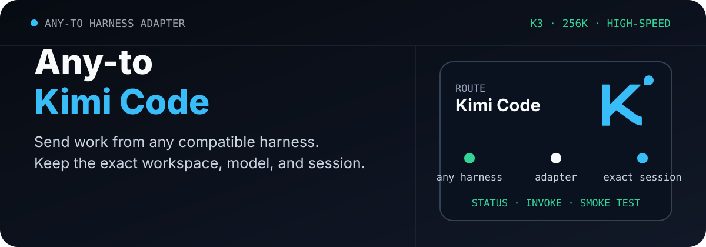
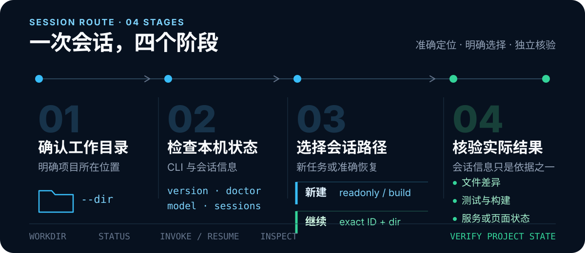

<p align="center">
  <picture>
    <source media="(max-width: 680px)" srcset="./assets/readme/hero-mobile.svg">
    
  </picture>
</p>

<p align="center">
  <strong>English</strong> · <a href="./README.zh-CN.md">简体中文</a>
</p>

<p align="center">
  <a href="./LICENSE"></a>
  
  
</p>

# Any-to-Kimi-Code

Connect any compatible coding harness to local Kimi Code sessions. The adapter starts, resumes, and inspects headless Kimi CLI work in an explicit directory, then returns structured results.

This repository is a local session adapter: a Python CLI, plus a Codex Skill wrapper. It does not install, upgrade, or log into Kimi Code, and it is not an official Moonshot product.

## What it does

- Resume a formal session only with the exact session ID and original working directory.
- Create a new session in `readonly` or `build` mode.
- Return the requested model, actual model, permission mode, active tools, tool-call names, and the last assistant text.
- On Windows timeouts, stop only the process tree started by that call.
- Run an isolated live smoke test in a temporary Kimi data directory.

Codex, Claude Code, Grok Build, and other tools can call the Python CLI. Codex users can also invoke `$codex-kimi-session` after installing the Skill.

## How it works

<p align="center">
  
</p>

1. Set the project directory and run `status`.
2. Create a new session for a new task. Use `--mode readonly` when the work should not write files.
3. Continue an existing task with both the exact `session_id` and the original working directory.
4. Use `inspect` for session metadata, then check diffs, tests, and running processes yourself.

## Install

You need Windows PowerShell, Python 3.11+, and an installed, configured Kimi Code CLI.

```powershell
git clone https://github.com/ZiChenWang114514/Any-to-Kimi-Code.git `
  "$env:USERPROFILE\.codex\skills\codex-kimi-session"
```

The clone destination is the Codex Skill id, `codex-kimi-session`. Other harnesses can run `scripts/kimi_session.py` directly.

The helper looks for the CLI in this order: `KIMI_CODE_EXE`, `PATH`, then `KIMI_CODE_HOME\bin`. The Kimi data directory comes from `KIMI_CODE_HOME`, or from Kimi's own default when that variable is unset.

```powershell
$KimiSkill = Join-Path $env:USERPROFILE ".codex\skills\codex-kimi-session"
$Runner = Join-Path $KimiSkill "scripts\kimi_session.py"
$Repo = "C:\path\to\your\repo"

python --version
kimi --version
```

## First use

### 1. Check local status

```powershell
python $Runner status --dir $Repo --json
```

`status` runs `kimi --version`, `kimi doctor`, and `kimi provider list`, then reads the session index and related processes. `ok: true` means those checks passed. It does not by itself prove network access, credentials, or a live model call.

### 2. Start a read-only session

```powershell
python $Runner invoke `
  --dir $Repo `
  --mode readonly `
  --prompt "Read the project structure and list high-priority issues. Do not edit files." `
  --json
```

If you omit `--mode`, the helper uses `build`. Write the mode explicitly on every new session.

### 3. Inspect the exact session

```powershell
$SessionId = "01234567-89ab-cdef-0123-456789abcdef"

python $Runner inspect `
  --dir $Repo `
  --session-id $SessionId `
  --json
```

The helper checks the unique index record, the session directory, and the session ID plus working directory in `state.json`.

### 4. Resume the same session

```powershell
python $Runner invoke `
  --dir $Repo `
  --session-id $SessionId `
  --prompt "Continue by checking whether the README matches the implementation." `
  --json
```

Do not pass `--mode`, `--model`, `--agent`, `--agent-file`, `--add-dir`, or `--skills-dir` when resuming. Those flags apply only to new sessions.

### 5. Use build mode after explicit authorization

```powershell
python $Runner invoke `
  --dir $Repo `
  --mode build `
  --prompt "Fix the confirmed issues in the existing style, then report the changes and verification." `
  --json
```

Build mode can modify the working directory. Confirm the directory, task scope, and any existing uncommitted changes first.

## Commands

| Command | Purpose | Calls a live model | Keeps a formal session |
|---|---|:---:|:---:|
| `status` | Check CLI, doctor output, model aliases, session count, and processes | No | No |
| `invoke` | Create or resume a Kimi session | Yes | Yes |
| `inspect` | Inspect metadata for one exact session | No | Reads an existing session |
| `smoke-test` | Run a live call in a temporary environment | Yes | No |

The default timeout is `1800` seconds. Prompt text is capped at `24000` characters. `--prompt-file` is the reliable way to pass UTF-8 and multiline text.

## What `readonly` means

`--mode readonly` loads the Agent file shipped with this repository:

| Allowed | Disabled |
|---|---|
| `Read`, `Grep`, `Glob`, `ReadMediaFile` | `Write`, `Edit`, `Bash` |
| `WebSearch`, `FetchURL` | `Agent`, `AgentSwarm`, `AskUserQuestion` |

This is not an offline mode and not OS-level isolation. Check `active_tools`, `disallowed_tools`, and `tool_call_names` in the result.

## Isolated live test

```powershell
python $Runner smoke-test --dir $Repo --json
```

The smoke test:

- Creates a temporary `KIMI_CODE_HOME` and a temporary working directory.
- Copies existing `config.toml`, `region`, `device_id`, and the `credentials` directory.
- Makes a real authenticated model call. That uses network access and account quota.
- Tries to delete the temporary copy after the process exits. That is not secure erasure.
- Currently compares the SHA-256 of the main `session_index.jsonl` and does not scan every file in the real Kimi data directory.
- Currently checks that six known disabled tools are absent; it does not prove an exact allow-list.

Run it only when you accept those behaviors and the account usage.

## How to tell that work is done

A zero exit code, a session ID, assistant text, or a model alias is not enough. Also check:

- Whether git diffs match the intended change and preserve unrelated work.
- Whether tests, builds, or target commands actually succeeded.
- Whether the application, service, or page is in the expected state.
- Whether Kimi's written conclusion is supported by files and command output.

`inspect` returns session metadata. It does not replace repository verification.

## Secrets and local data

- Do not put passwords, tokens, or auth config in prompts, Agent files, paths, or output.
- `--prompt-file` is a quoting convenience. It does not hide prompt contents.
- The helper reads session event files and extracts selected fields.
- Error text only redacts some common token shapes. Final replies, provider fields, and paths are not generally sanitized.
- Review working directory, process, provider, session title, and model reply fields before sharing JSON.
- Formal `invoke` sessions stay in Kimi's session directory. This project does not ship a delete-session command.

## Known limits

- There is no pinned Kimi Code CLI version and no public compatibility matrix.
- If Kimi changes tool names, event format, or Agent interpretation, parsing and the read-only test may need an update.
- Windows timeouts use `taskkill /PID ... /T /F` on the process tree started by this helper. Other systems stop only the direct child process.
- `latest_workdir_session_id` is the last matching index entry, not a time-sorted choice. Do not auto-resume from it.
- The last parsed assistant text is the last matching event. It does not mean the repository work is done.

## Using it from a coding agent

```text
Use $codex-kimi-session in C:\path\to\repo.
Start a readonly session, read the project, and summarize architecture
and risks. Do not modify files.
```

Resume with the exact ID:

```text
Use $codex-kimi-session in C:\path\to\repo.
Continue session 01234567-89ab-cdef-0123-456789abcdef
and check progress from the previous analysis.
```

## Repository layout

```text
.
├─ SKILL.md
├─ agents/openai.yaml
├─ scripts/kimi_session.py
├─ references/defaults.json
├─ references/kimi-readonly-agent.md
├─ references/operation-protocol.md
└─ assets/readme/
```

Command details live in [`SKILL.md`](SKILL.md) and [`references/operation-protocol.md`](references/operation-protocol.md).

## Machine-readable contract

Every command accepts `--json`. The shared fields are `schema_version`, `ok`, `target`, `command`, `provider`, `workdir`, `session_id`, `requested_model`, `actual_model`, `result`, `warnings`, and `error`. Adapter-specific evidence remains alongside them.

## Related adapters

| Repository | Target |
| --- | --- |
| [Any-to-OpenCode](https://github.com/ZiChenWang114514/Any-to-OpenCode) | OpenCode |
| [Any-to-Grok-Build](https://github.com/ZiChenWang114514/Any-to-Grok-Build) | Grok Build |
| [Any-to-ZCode](https://github.com/ZiChenWang114514/Any-to-ZCode) | ZCode / GLM |
| [Any-to-DeepSeek-Harness](https://github.com/ZiChenWang114514/Any-to-DeepSeek-Harness) | DeepSeek Harness |
| [Any-to-Codex](https://github.com/ZiChenWang114514/Any-to-Codex) | Codex CLI |
| [Any-to-Claude-Code](https://github.com/ZiChenWang114514/Any-to-Claude-Code) | Claude Code |
| [Any-to-Pi](https://github.com/ZiChenWang114514/Any-to-Pi) | Pi |
| [Any-to-Antigravity](https://github.com/ZiChenWang114514/Any-to-Antigravity) | Google Antigravity CLI |

## License

[MIT](./LICENSE) © 2026 Zichen Wang
