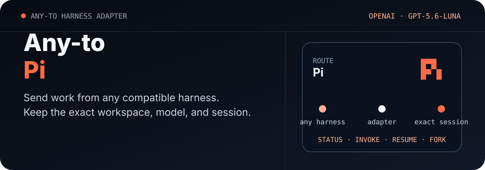

<p align="center">
  <picture>
    <source media="(max-width: 680px)" srcset="./assets/readme/hero-mobile.svg">
    
  </picture>
</p>

<p align="center"><a href="./README.md">English</a> · <strong>简体中文</strong></p>

<p align="center">
  <a href="https://github.com/ZiChenWang114514/Any-to-Pi/actions/workflows/ci.yml"></a>
  · Windows · Python 3.11+ · MIT
</p>

# Any-to-Pi

让任意兼容的编码 Harness 调用本机 [Pi coding agent](https://github.com/earendil-works/pi)。适配器会在明确的工作目录中启动非交互任务，返回一个稳定 JSON 对象，并通过准确 ID 继续或 fork Pi 会话。

项目沿用用户现有的 Pi 安装、认证、扩展和模型配置，不安装 Pi、不复制凭据，也不更改全局设置。

## 先确认状态

```powershell
python .\scripts\pi_session.py status --json
```

状态命令会检查 Pi 版本、OpenAI Codex OAuth、`gpt-5.6-luna` 模型，以及 JSON 事件、准确会话和 fork 所需的 CLI 参数。

## 工作方式

```text
任意兼容 Harness
        │
        ▼
scripts/pi_session.py
        │  pi --mode json --print
        ▼
指定工作目录中的准确 Pi 会话
```

Python 脚本是可移植接口；`$codex-pi-session` 是调用同一组命令的可选 Codex Skill。

## 安装

```powershell
git clone https://github.com/ZiChenWang114514/Any-to-Pi.git `
  "$env:USERPROFILE\.codex\skills\codex-pi-session"
```

其他 Harness 可以将仓库克隆到任意目录，然后直接调用 `scripts/pi_session.py`。

## 首次调用

```powershell
python .\scripts\pi_session.py invoke `
  --workdir C:\path\to\repo `
  --prompt "检查此仓库并总结测试命令。" `
  --provider openai-codex `
  --model gpt-5.6-luna `
  --json
```

省略 `--provider` 和 `--model` 时，Pi 会使用当前配置。

## 准确会话操作

```powershell
python .\scripts\pi_session.py resume `
  --workdir C:\path\to\repo `
  --session-id <session-id> `
  --prompt "继续上一轮任务。" `
  --json

python .\scripts\pi_session.py fork `
  --workdir C:\path\to\repo `
  --session-id <session-id> `
  --prompt "独立探索另一种实现。" `
  --json
```

`resume` 延续选定对话，`fork` 从该历史创建新会话。Pi 项目会话与工作目录关联，因此两个命令都需要原工作目录和准确 ID。

## 机器可读接口

每个命令都接受 `--json`，公共字段为：

```text
schema_version · ok · target · command · provider · workdir
session_id · requested_model · actual_model · result · warnings · error
```

成功退出码为 `0`，调用或验证失败为 `1`，参数无效为 `2`。

## 验证

```powershell
python -m unittest discover -s tests -v
python .\scripts\pi_session.py smoke-test `
  --provider openai-codex --model gpt-5.6-luna --json
```

单元测试使用模拟事件，不需要凭据。真实 Smoke Test 会创建临时 Git 与会话目录，关闭工具和本机扩展，然后验证新会话、准确续接、fork、请求模型与实际模型。

2026-08-28 已使用 Pi `0.84.3` 完成本机验证：新会话、准确续接与 fork 均返回请求的 `openai-codex/gpt-5.6-luna` 路由。

## 使用说明

- 需要可复现诊断时使用 `--isolated`，避免载入 Pi 扩展、Skill 和上下文文件。
- 只验证回复时使用 `--no-tools`；经用户许可的编码任务可以省略该参数。
- 适配器不会自动选择最近会话。
- 代理完成编码后，仍需检查实际文件修改与项目测试。
- JSON 结果不会包含认证信息。

## 相关项目

| 仓库 | 目标 Harness |
|---|---|
| [Any-to-OpenCode](https://github.com/ZiChenWang114514/Any-to-OpenCode) | OpenCode |
| [Any-to-Grok-Build](https://github.com/ZiChenWang114514/Any-to-Grok-Build) | Grok Build |
| [Any-to-Kimi-Code](https://github.com/ZiChenWang114514/Any-to-Kimi-Code) | Kimi Code |
| [Any-to-ZCode](https://github.com/ZiChenWang114514/Any-to-ZCode) | ZCode / GLM |
| [Any-to-DeepSeek-Harness](https://github.com/ZiChenWang114514/Any-to-DeepSeek-Harness) | DeepSeek Harness |
| [Any-to-Codex](https://github.com/ZiChenWang114514/Any-to-Codex) | Codex CLI |
| [Any-to-Claude-Code](https://github.com/ZiChenWang114514/Any-to-Claude-Code) | Claude Code |
| [Any-to-Pi](https://github.com/ZiChenWang114514/Any-to-Pi) | Pi |
| [Any-to-Antigravity](https://github.com/ZiChenWang114514/Any-to-Antigravity) | Google Antigravity CLI |

## 许可证

MIT。本项目是独立适配器，与 Pi 项目及 OpenAI 没有关联。
