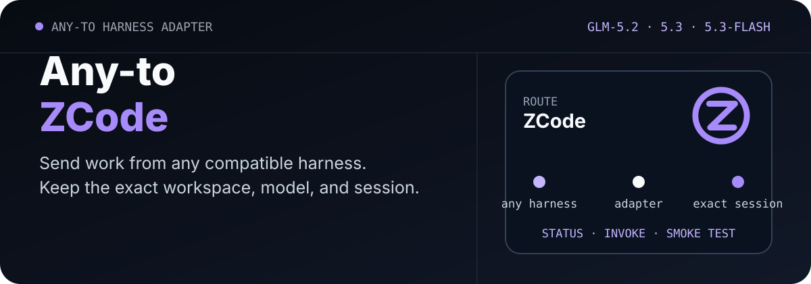

<p align="center">
  <picture>
    <source media="(max-width: 680px)" srcset="./assets/readme/hero-mobile.svg">
    
  </picture>
</p>

<p align="center">
  <a href="./README.md">English</a> · <strong>简体中文</strong>
</p>

<p align="center">
  <a href="https://github.com/ZiChenWang114514/Any-to-ZCode/actions/workflows/ci.yml"></a>
  · Windows · Python 3.10+ · MIT
</p>

# Any-to-ZCode

把任意兼容的编码助手接到本机 ZCode CLI 会话。它会在不打印凭据的前提下报告当前 GLM 线路，在指定目录运行无头任务，并按完整的 `sess_...` 标识继续同一会话。

本仓库是本地会话适配器：一套 Python 命令行工具，外加 Codex Skill 封装。它独立于 Z.ai 和 `zcode-app-cli` 维护者。

## 已核验内容

| 检查项 | 当前证据 |
| --- | --- |
| Skill 结构与 Python 封装 | 在 Windows CI 中通过 |
| ZCode 运行时发现 | `zcode-app-cli 3.9.2-16`，runtime `0.16.5` |
| 模型目录 | 检测到 GLM-5-Turbo、GLM-5.2、GLM-5.3 和 GLM-5.3-Flash |
| 多模态声明 | GLM-5.3-Flash 声明支持图片、PDF 和视频输入 |
| 真实 GLM 回复 | 需要已配置的 Coding Plan 密钥；目录可见不能证明当前可访问 |

## 它能做什么

- 用完整会话 ID 继续会话，并保持原工作目录。脚本不会使用 ZCode 的“最近会话”捷径。
- 以 JSON 返回版本、已选模型、多模态条目和配置状态。
- 每次无头请求可选择 `plan`、`build`、`edit` 或 `yolo`。
- 冒烟测试使用临时 `ZCODE_HOME`，结束后删除测试数据。
- 长提示写入 UTF-8 文件，避免命令行引号问题。

Codex、Claude Code、Grok Build 等工具都可以直接调用 Python 脚本。安装 Skill 后，Codex 也可以使用 `$codex-zcode-session`。

## 安装

本适配器面向 [`zcode-app-cli`](https://github.com/kingsword09/zcode-cli)，这是 ZCode Desktop 所带官方 agent runtime 的非官方终端客户端。

```powershell
npm install -g zcode-app-cli@latest
zcode --version
```

需要 Node.js 22.19 或更高版本。在 Windows 上先打开一次 `zcode`，通过遮蔽输入界面配置 Z.AI 或 BigModel Coding Plan 密钥。

```powershell
git clone https://github.com/ZiChenWang114514/Any-to-ZCode.git `
  "$env:USERPROFILE\.codex\skills\codex-zcode-session"
```

克隆目标目录是 Codex Skill 标识 `codex-zcode-session`。其他编码助手可以直接运行 `scripts/zcode_session.py`。

## 最快开始

```powershell
python "$env:USERPROFILE\.codex\skills\codex-zcode-session\scripts\zcode_session.py" `
  status --json
```

一次有用的首次结果类似：

```json
{
  "main_model": "bigmodel/GLM-5-Turbo",
  "lite_model": "zai/glm-5.3-flash",
  "required_models_present": true,
  "model_access_configured": false
}
```

`model_access_configured: false` 表示目录已安装，但还不能把真实模型请求说成已经成功。

只读分析使用 `plan`：

```powershell
python .\scripts\zcode_session.py invoke `
  --dir C:\path\to\repo `
  --prompt "检查失败的测试并说明原因。" `
  --mode plan --json
```

实现类任务使用 UTF-8 提示文件：

```powershell
python .\scripts\zcode_session.py invoke `
  --dir C:\path\to\repo `
  --prompt-file .\phase-1.txt `
  --mode build --json
```

用完整 ID 继续同一会话：

```powershell
python .\scripts\zcode_session.py invoke `
  --dir C:\path\to\repo `
  --session-id sess_xxxxxxxx `
  --prompt-file .\phase-2.txt --json
```

## 模型分工

| 角色 | 模型 | 输入 |
| --- | --- | --- |
| 主要工作 | `bigmodel/GLM-5-Turbo` | 文本 |
| 轻量与多模态 | `zai/glm-5.3-flash` | 文本、图片、PDF、视频 |
| 兼容选项 | `zai/glm-5.2`、`zai/glm-5.3` | 文本 |

修改用户配置会影响之后新建的会话。继续已有会话时，可能仍使用历史记录中的模型。

## 核验步骤

1. 运行 `status --json`，确认可执行文件、模型 ID 和凭据状态。
2. 阅读目标仓库说明、当前改动和测试命令。
3. 用明确的目录、提示和权限模式启动 `invoke`。
4. 检查实际文件差异，并运行项目自己的测试。
5. 只使用第一次调用返回的准确会话 ID 继续。

凭据配置完成后：

```powershell
python .\scripts\zcode_session.py smoke-test `
  --dir C:\path\to\safe-dir --json
```

## 在编码助手中使用

```text
使用 $codex-zcode-session，在 C:\path\to\repo 检查状态，
然后开一个 plan 模式会话，说明失败测试的原因，不要改文件。
```

## 安全说明

- 凭据只检查有无，不会打印具体值。
- 超时清理只针对本封装启动的进程。
- 适配器不会自行提交、推送、发布或改动无关文件。
- CLI 成功退出后，仍需检查仓库改动和测试结果。

## 机器可读结果

每个命令都支持 `--json`。统一字段包括 `schema_version`、`ok`、`target`、`command`、`provider`、`workdir`、`session_id`、`requested_model`、`actual_model`、`result`、`warnings` 和 `error`，并保留各适配器自己的验证信息。

## 同系列适配器

| 仓库 | 目标 |
| --- | --- |
| [Any-to-OpenCode](https://github.com/ZiChenWang114514/Any-to-OpenCode) | OpenCode |
| [Any-to-Grok-Build](https://github.com/ZiChenWang114514/Any-to-Grok-Build) | Grok Build |
| [Any-to-Kimi-Code](https://github.com/ZiChenWang114514/Any-to-Kimi-Code) | Kimi Code |
| [Any-to-DeepSeek-Harness](https://github.com/ZiChenWang114514/Any-to-DeepSeek-Harness) | DeepSeek Harness |
| [Any-to-Codex](https://github.com/ZiChenWang114514/Any-to-Codex) | Codex CLI |
| [Any-to-Claude-Code](https://github.com/ZiChenWang114514/Any-to-Claude-Code) | Claude Code |
| [Any-to-Pi](https://github.com/ZiChenWang114514/Any-to-Pi) | Pi |
| [Any-to-Antigravity](https://github.com/ZiChenWang114514/Any-to-Antigravity) | Google Antigravity CLI |

## 许可证

[MIT](./LICENSE)。ZCode CLI 行为可能随内嵌 runtime 变化，升级后请重新运行 `status` 和冒烟测试。
